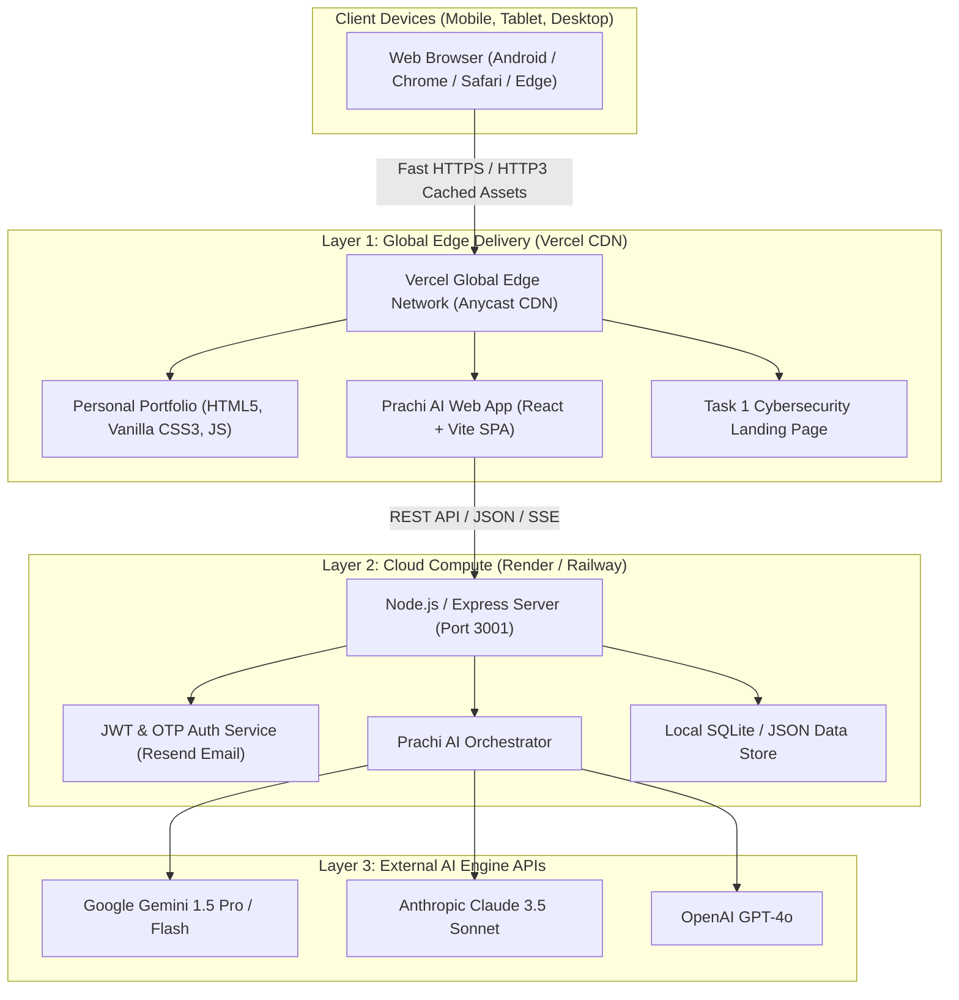
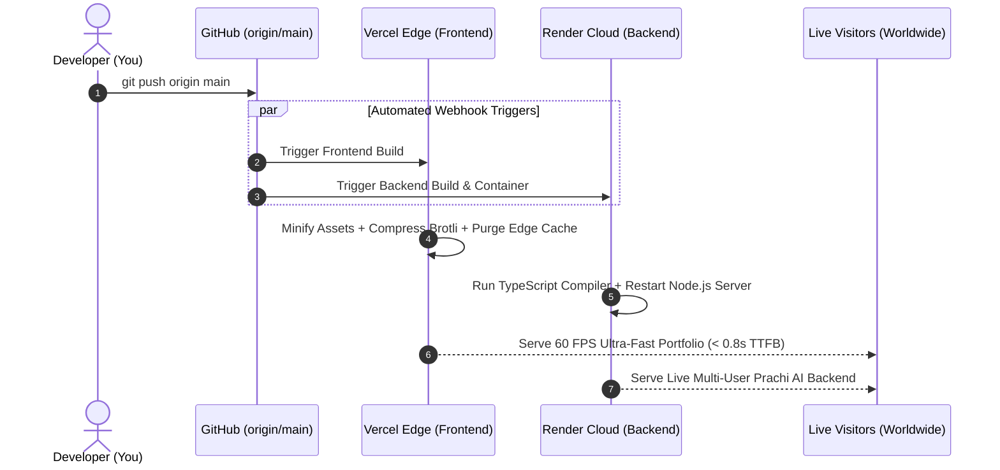
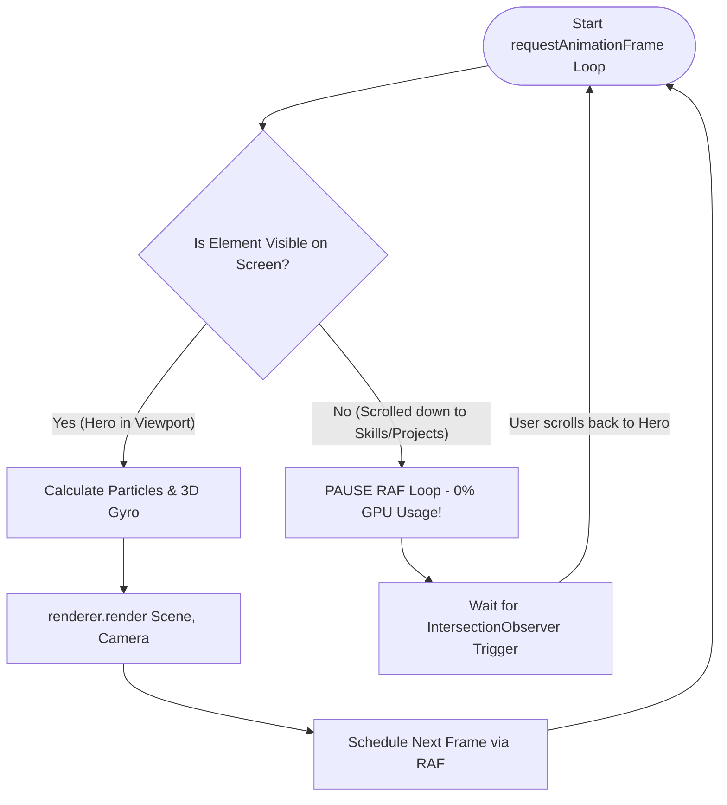

# 🚀 Project Deployment & Zero-Lag Architecture Roadmap
**Client / Project:** Himanshu Kumar Singh — Personal Portfolio & Prachi AI  
**Author:** AI Engineering Assistant  
**Date:** October 2026  
**Status:** Approved Deployment & Performance Blueprint  

---

## 📑 Table of Contents
1. [Root-Cause Analysis: Why Website Lags on GitHub Pages](#1-root-cause-analysis-why-website-lags-on-github-pages)
2. [Target Cloud Architecture (Block Diagrams)](#2-target-cloud-architecture-block-diagrams)
3. [Performance & FPS Optimization Pipeline (Lag-Elimination)](#3-performance--fps-optimization-pipeline-lag-elimination)
4. [Step-by-Step Deployment Roadmap](#4-step-by-step-deployment-roadmap)
   - [Phase 1: Zero-Lag Code Hardening](#phase-1-zero-lag-code-hardening)
   - [Phase 2: Frontend Deployment on Vercel (Global Edge CDN)](#phase-2-frontend-deployment-on-vercel-global-edge-cdn)
   - [Phase 3: Prachi AI Backend Deployment on Render / Railway](#phase-3-prachi-ai-backend-deployment-on-render--railway)
   - [Phase 4: Domain, DNS & End-to-End SSL Verification](#phase-4-domain-dns--end-to-end-ssl-verification)
5. [Environment Variables & Security Matrix](#5-environment-variables--security-matrix)
6. [Post-Deployment Validation Checklist (60 FPS & 90+ Lighthouse)](#6-post-deployment-validation-checklist-60-fps--90-lighthouse)

---

## 1. Root-Cause Analysis: Why Website Lags on GitHub Pages

GitHub Pages par website lag aur freeze hone ke 3 technical kaaran hain:

```
+-----------------------------------------------------------------------------------------+
|                                ROOT-CAUSE BREAKDOWN                                     |
+-----------------------------------------------------------------------------------------+
| 1. DUAL 3D WEBGL RENDERING LOOPS (UNPAUSED)                                             |
|    - Background Starfield Canvas (#bg3dCanvas) + Hero Holographic Core (#hero3dCanvas)  |
|    - Dono Three.js scenes 60 times/sec GPU me render ho rahi hain even jab user page    |
|      ke footer me ho! Is se GPU & CPU throttle ho kar frame drops karte hain (15-20 FPS)|
+-----------------------------------------------------------------------------------------+
| 2. GITHUB PAGES IS PURE STATIC (NO DYNAMIC BACKEND)                                     |
|    - GitHub Pages sirf static HTML/CSS/JS serve karta hai.                              |
|    - Prachi AI ka Node.js/Express backend, OTP authentication aur SQLite database       |
|      GitHub Pages par run nahi ho sakta. Result: Timeout errors & failed API loops.     |
+-----------------------------------------------------------------------------------------+
| 3. EXCESSIVE CSS BACKDROP-FILTER BLURS & UNTHROTTLED MOUSE LISTENERS                    |
|    - Multiple overlapping `backdrop-filter: blur(20px)` and unthrottled mousemove       |
|      events low-end GPUs aur Android mobile browsers ko freeze kar dete hain.           |
+-----------------------------------------------------------------------------------------+
```

---

## 2. Target Cloud Architecture (Block Diagrams)

### 2.1 System Architecture Diagram



---

### 2.2 Continuous Deployment (CI/CD) Workflow



---

## 3. Performance & FPS Optimization Pipeline (Lag-Elimination)

Website ko 60 FPS silky smooth banane ke liye Three.js render loop me **Intersection Observer Visibility Guard** implement kiya jata hai:



### Key Performance Fixes:
1. **IntersectionObserver Pause:** Jab Hero section screen se bahar scroll ho, `cancelAnimationFrame` call karke rendering 0% GPU load par le aao.
2. **Device Pixel Ratio Clamping:** `renderer.setPixelRatio(Math.min(window.devicePixelRatio, 1.5))` — Retina aur 4K screens par GPU overheat hone se bachata hai.
3. **Throttled Mouse Parallax:** Mouse events ko `requestAnimationFrame` flag ke sath throttle karo taaki continuous layout shifts na ho.

---

## 4. Step-by-Step Deployment Roadmap

### Phase 1: Zero-Lag Code Hardening
- [ ] Add `IntersectionObserver` to `#hero3dCanvas` inside `script.js`.
- [ ] Limit particle count on mobile screens (<= 768px).
- [ ] Build production bundles for `Prachi AI` with `node build.mjs`.

### Phase 2: Frontend Deployment on Vercel (Global Edge CDN)
1. **Account Creation:**
   - [vercel.com](https://vercel.com) par jao aur apne GitHub account se **Sign In** karo.
2. **Import Project:**
   - Dashboard me **"Add New..."** -> **"Project"** select karo.
   - Apni repository **`himanshu161098/personal-portfolio`** search karke **Import** karo.
3. **Project Settings:**
   - **Framework Preset:** `Other`
   - **Root Directory:** `./` (Root)
   - **Build Command:** `node "Personal Portfolio/Prachi AI/frontend/build.mjs"` (Optional, bundles already pre-built)
   - **Output Directory:** `./`
4. **Deploy:**
   - **Deploy** button click karo.
   - 30 seconds me live URL generate ho jayega: `https://personal-portfolio-himanshu.vercel.app`.

### Phase 3: Prachi AI Backend Deployment on Render / Railway
1. **Render.com Setup:**
   - [render.com](https://render.com) par free account banao.
   - Click **"New +"** -> **"Web Service"**.
   - Connect repository `himanshu161098/personal-portfolio`.
2. **Service Configuration:**
   - **Name:** `prachi-ai-backend`
   - **Region:** Singapore / Frankfurt (Low latency to India)
   - **Branch:** `main`
   - **Root Directory:** `Prachi AI/backend`
   - **Runtime:** `Node`
   - **Build Command:** `npm install && npm run build`
   - **Start Command:** `npm start` (ya `node dist/server.js`)
3. **Environment Variables:**
   - `NODE_ENV=production`
   - `PORT=3001`
   - `JWT_SECRET=super_secret_secure_key_1610`
   - `GEMINI_API_KEY=your_gemini_api_key`
4. **Connect Frontend to Backend:**
   - Render live backend URL dega (e.g., `https://prachi-ai-backend.onrender.com`).
   - Frontend ke `api.ts` me production API URL set karke GitHub par commit karo.

### Phase 4: Domain & SSL Verification
- Vercel aur Render dono **Automatic Free SSL Certificate (HTTPS)** provide karte hain.
- Custom domain (e.g. `himanshukumar.dev` ya `himanshukumar.in`) Vercel ke **Domains** settings me 1-click me connect ho jata hai.

---

## 5. Environment Variables & Security Matrix

| Variable Name | Environment | Purpose | Sensitivity |
| :--- | :--- | :--- | :--- |
| `PORT` | Backend (Render) | Server listening port (`3001`) | Low |
| `JWT_SECRET` | Backend (Render) | User authentication token signature | **High (Secret)** |
| `GEMINI_API_KEY` | Backend (Render) | Google Gemini 1.5 AI model generation | **High (Secret)** |
| `OPENAI_API_KEY` | Backend (Render) | Optional OpenAI GPT-4o inference | **High (Secret)** |
| `RESEND_API_KEY` | Backend (Render) | Live OTP verification emails | **High (Secret)** |
| `ALLOWED_ORIGIN` | Backend (Render) | CORS security whitelist (Vercel domain) | Medium |

---

## 6. Post-Deployment Validation Checklist

- [ ] **Lighthouse Performance Score:** 90+ on Desktop & Mobile.
- [ ] **Frame Rate (FPS):** Stable 60 FPS scrolling through entire portfolio.
- [ ] **Mobile Responsiveness:** Zero horizontal scroll, touch-friendly drawers on Android & iOS.
- [ ] **Prachi AI Authentication:** Live OTP email login working flawlessly via Render backend.
- [ ] **Cyber HUD Hover Overview:** Active scan card appears seamlessly with no lag on desktop.
- [ ] **Automated CI/CD:** Any change pushed via `git push origin main` auto-deploys to Vercel in seconds.

---
*Created for Himanshu Kumar Singh | CSE-IT Engineering Portfolio Architecture*
